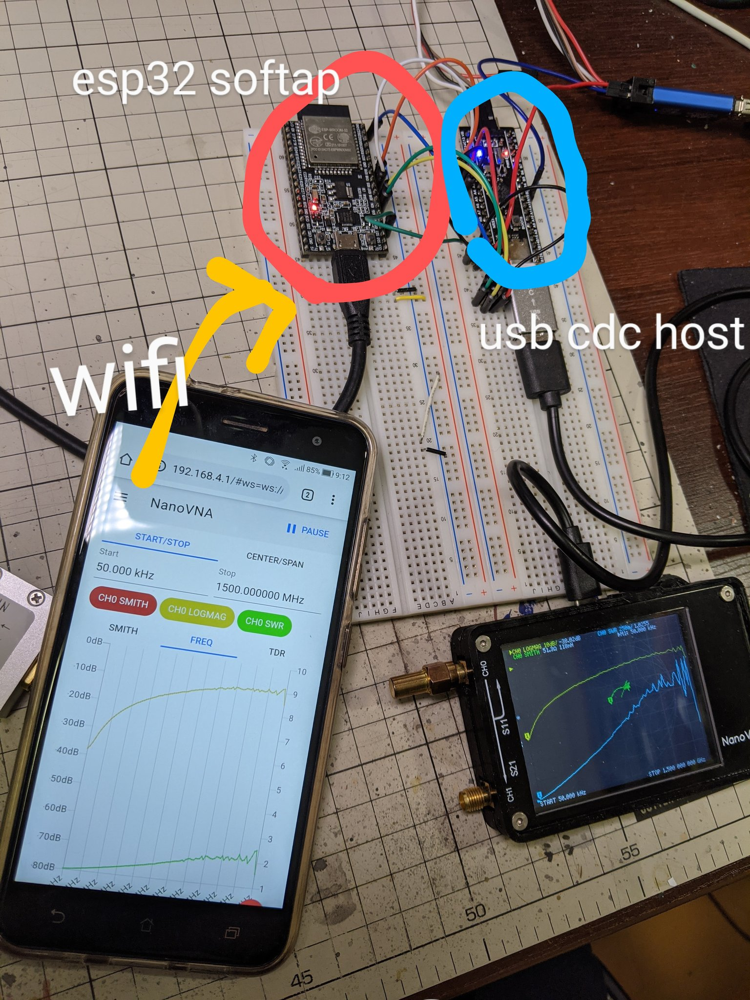

# NanoVNA Wi-Fi connection impl.



## Schematic

 * ./cdc-to-websocket/cdc-to-websocket.svg
 * STM32F401 firmware: https://github.com/cho45/stm32f401-usbserial-host

## Configure Wi-Fi Mode (AP or Station)

IO15 is pulled-up input

- connect to GND: work as station for debug (ID/PASS is set by `idf.py menuconfig`)
- open: work as AP

## Build

require esp-idf https://docs.espressif.com/projects/esp-idf/en/latest/esp32/get-started/index.html#get-started-get-esp-idf

`idf.py build`

build and flash

```
idf.py -p /dev/tty.SLAB_USBtoUART flash monitor
```
